```python
import matplotlib
```


```python
print(matplotlib.__version__)
```

    3.1.0


```python
import matplotlib.pyplot as plt
```


```python
import numpy as np
```


```python
plt.plot([-5,5,2,3,4])
```


    [<matplotlib.lines.Line2D at 0x7f809c76ae48>]


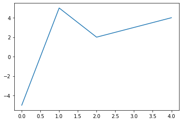


```python
plt.show()
```


```python
plt.plot([-5,5,2,3,4], 'or')
```


    [<matplotlib.lines.Line2D at 0x7f809c68c3c8>]


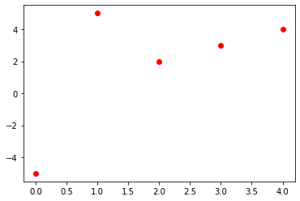


```python
plt.plot([-5,5,2,3,4], 'r')
```


    [<matplotlib.lines.Line2D at 0x7f809c5f34a8>]


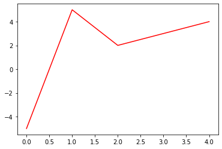


```python
days = list(range(0,22,3))
temp = [34,24,23.31,4,40,10,6,9]
temp2 = [20,34,36,40,26,36,30,24]
plt.plot(days,temp,'og')
plt.plot(days,temp,'g')
plt.plot(days,temp2, 'or')
plt.plot(days,temp2,'r')
plt.xlabel('days')
plt.ylabel('tempreture')
ax = plt.gca()
ax.spines['right'].set_visible(False)
ax.spines['top'].set_visible(False)
ax.spines['bottom'].set_bounds(0,30)
plt.xticks(range(0,28,7),['w1','w2','w3','w4'])
#plt.axis('off')
#plt.axis('on')
plt.show()
```


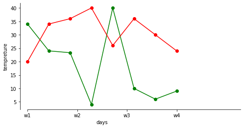


```python
plt.scatter(days,temp)
plt.scatter(days,temp2)
plt.show()
```


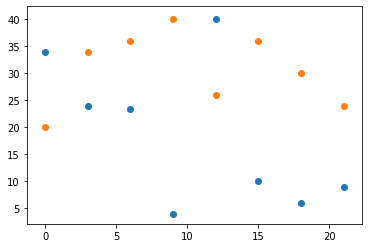


```python
ax = plt.gca()
ax.spines['right'].set_visible(False)
ax.spines['top'].set_visible(False)
```


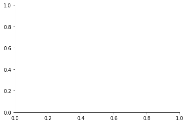


```python
x = [2,5,7,3,8,3,9,3,6,3,2]
y = [4,6,3,8,3,8,2,8,3,8,9]
plt.axes().set_aspect('equal')
plt.plot(x,y)
plt.show()
```


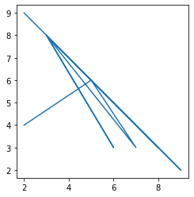


```python
x = [2,5,7,3,8,3,9,3,6,3,2]
y = [4,6,3,8,3,8,2,8,3,8,9]
plt.axes().invert_xaxis()
plt.plot(x,y)
plt.show()
```


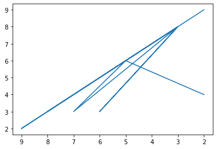


```python
x = [2,5,7,3,8,3,9,3,6,3,2]
y = [4,6,3,8,3,8,2,8,3,8,9]
plt.axes().invert_yaxis()
plt.plot(x,y)
plt.show()
```


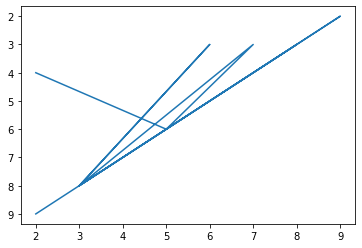


```python
x = [2,5,7,3,8,3,9,3,6,3,2]
y = [4,6,3,8,3,8,2,8,3,8,9]
plt.axes().invert_xaxis()
plt.axes().invert_yaxis()
plt.plot(x,y)
plt.show()
```

    /home/renuka/anaconda3/lib/python3.7/site-packages/ipykernel_launcher.py:4: MatplotlibDeprecationWarning: Adding an axes using the same arguments as a previous axes currently reuses the earlier instance.  In a future version, a new instance will always be created and returned.  Meanwhile, this warning can be suppressed, and the future behavior ensured, by passing a unique label to each axes instance.
      after removing the cwd from sys.path.


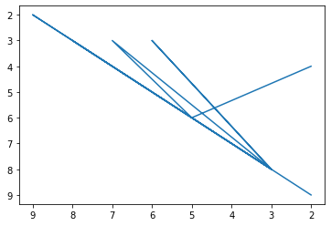


```python
days = list(range(0,22,3))
temp = [34,24,23.31,4,40,10,6,9]
temp2 = [20,34,36,40,26,36,30,24]
plt.plot(days,temp,'og')
plt.plot(days,temp,'g',label='temp1')
plt.plot(days,temp2, 'or')
plt.plot(days,temp2,'r',label='temp2')
plt.xlabel('days')
plt.ylabel('tempreture')
ax = plt.gca()
ax.spines['right'].set_visible(False)
ax.spines['top'].set_visible(False)
ax.spines['bottom'].set_bounds(0,30)
plt.xticks(range(0,28,7),['w1','w2','w3','w4'])
#plt.axis('off')
#plt.axis('on')
#plt.legend(loc="upper left")
plt.legend(loc="best")
plt.annotate("tempreture diffrence\in a week",xy = (4,40))
plt.show()
```


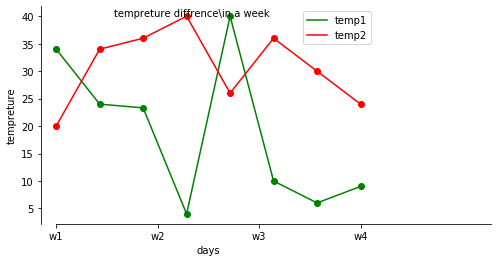


```python
plt.figure(figsize=[12,10])

sub1 = plt.subplot(2,2,1)
sub2 = plt.subplot(2,2,2)
sub3 = plt.subplot(2,2,3)
sub4 = plt.subplot(2,2,4)

sub1.plot(days,temp , 'or')
sub2.plot(days,temp, 'r')
sub3.plot(days,temp2, 'og')
sub4.plot(days,temp2, 'g')

plt.show()
```


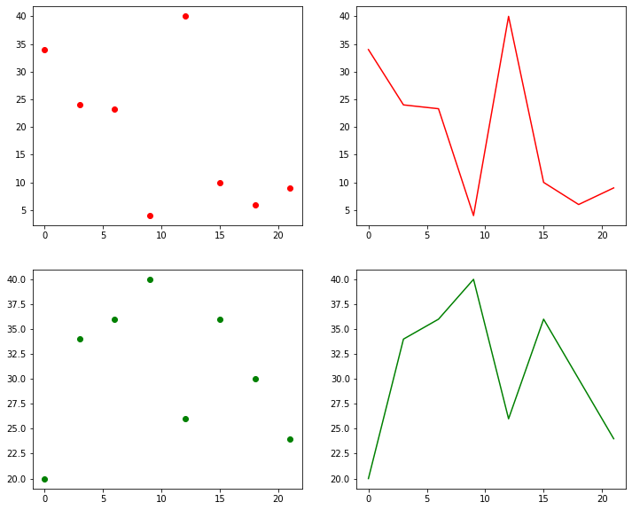


```python
import matplotlib.gridspec as gridspec
```


```python
gridspec.GridSpec(2,2)

plt.subplot2grid((2,2),(0,0),colspan = 1 , rowspan = 1)
plt.plot(days,temp)
plt.subplot2grid((2,2),(0,1),colspan = 1 , rowspan = 1)
plt.plot(days,temp2)
plt.subplot2grid((2,2),(1,0),colspan = 2 , rowspan = 1)
plt.plot(days,temp,'og')
```


    [<matplotlib.lines.Line2D at 0x7f809bec9780>]


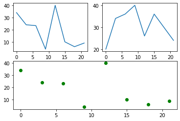


```python
p1 = plt.scatter(temp,days, c=days)
plt.colorbar(p1)
```


    <matplotlib.colorbar.Colorbar at 0x7f809c2baa58>


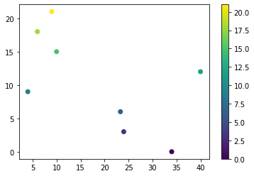


```python
gauss = np.random.normal(size=100)
```


```python
plt.plot(gauss)
```


    [<matplotlib.lines.Line2D at 0x7f809c156898>]


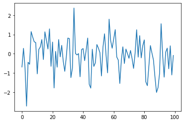


```python
plt.hist(gauss)
```


    (array([ 1.,  4.,  8., 12., 17., 27., 20.,  8.,  2.,  1.]),
     array([-2.72155793, -2.21211042, -1.70266291, -1.1932154 , -0.6837679 ,
            -0.17432039,  0.33512712,  0.84457463,  1.35402214,  1.86346965,
             2.37291716]),
     <a list of 10 Patch objects>)


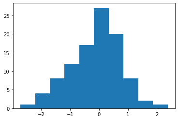


```python
plt.hist(gauss , bins= 25 , color = 'r')
```


    (array([ 1.,  0.,  0.,  1.,  3.,  3.,  1.,  6.,  4.,  6.,  5.,  8.,  9.,
            10., 12.,  8.,  8.,  6.,  3.,  3.,  0.,  1.,  1.,  0.,  1.]),
     array([-2.72155793, -2.51777893, -2.31399992, -2.11022092, -1.90644192,
            -1.70266291, -1.49888391, -1.29510491, -1.0913259 , -0.8875469 ,
            -0.6837679 , -0.47998889, -0.27620989, -0.07243089,  0.13134812,
             0.33512712,  0.53890613,  0.74268513,  0.94646413,  1.15024314,
             1.35402214,  1.55780114,  1.76158015,  1.96535915,  2.16913815,
             2.37291716]),
     <a list of 25 Patch objects>)


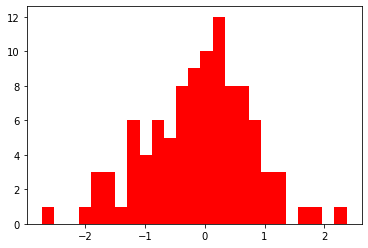


```python
plt.hist(gauss , bins= 25 , color = 'r' , edgecolor = 'b')
```


    (array([ 1.,  0.,  0.,  1.,  3.,  3.,  1.,  6.,  4.,  6.,  5.,  8.,  9.,
            10., 12.,  8.,  8.,  6.,  3.,  3.,  0.,  1.,  1.,  0.,  1.]),
     array([-2.72155793, -2.51777893, -2.31399992, -2.11022092, -1.90644192,
            -1.70266291, -1.49888391, -1.29510491, -1.0913259 , -0.8875469 ,
            -0.6837679 , -0.47998889, -0.27620989, -0.07243089,  0.13134812,
             0.33512712,  0.53890613,  0.74268513,  0.94646413,  1.15024314,
             1.35402214,  1.55780114,  1.76158015,  1.96535915,  2.16913815,
             2.37291716]),
     <a list of 25 Patch objects>)


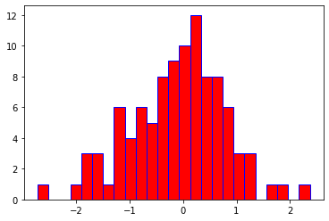


```python
#countour and heatmaps
```


```python
xlist = np.linspace(-1,1,20)
ylist = np.linspace(-1,1,20)
```


```python
X,Y = np.meshgrid(xlist,ylist)
Z = np.sqrt(X*X+Y*Y)
cp = plt.contour(X,Y,Z)
plt.clabel(cp)
```


    <a list of 9 text.Text objects>


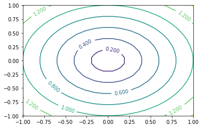


```python
X,Y = np.meshgrid(xlist,ylist)
Z = np.sqrt(X*X+Y*Y)
cp = plt.contourf(X,Y,Z)
```


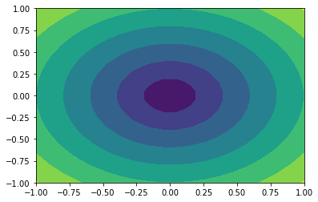


```python

```


```python

```
